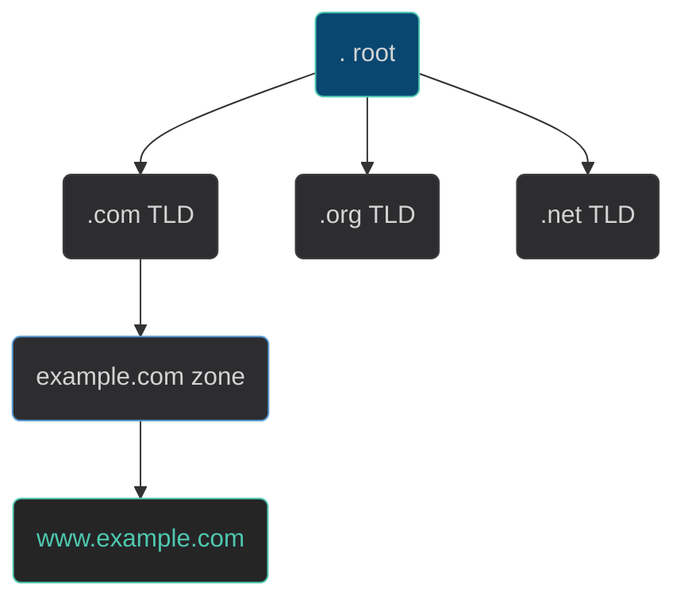
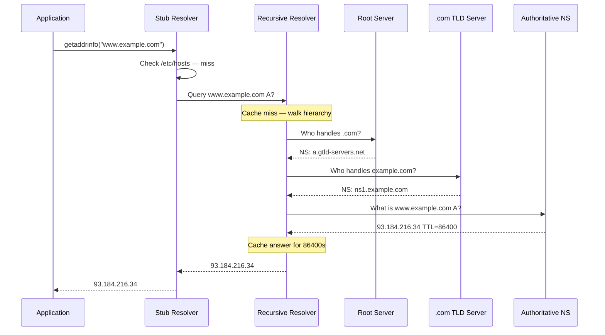

# DNS Deep Dive

## DNS: The Global Directory — How It Works End to End

DNS (Domain Name System) is a globally distributed, hierarchical database that maps human-readable names to IP addresses. Understanding the full resolution path is essential for diagnosing any name resolution failure.

### The Hierarchy

DNS is a tree. Every name is a path from leaf to root, read right-to-left:



`www.example.com.` — the trailing dot is the root; it is always implied.

**Three types of DNS servers:**

| Type | Role | Examples |
|------|------|---------|
| **Stub resolver** | Client library in your OS; forwards to a recursive resolver | glibc `getaddrinfo`, systemd-resolved |
| **Recursive resolver** (full-service resolver) | Does the work of walking the hierarchy; caches results | Your ISP's resolver, 8.8.8.8, 1.1.1.1 |
| **Authoritative nameserver** | Holds the actual records for a zone; answers with authority | ns1.example.com, Route53, Cloudflare |

### The Full Resolution Walk for `www.example.com`



The recursive resolver only does this full walk on a **cache miss**. On a **cache hit** (TTL not expired) it answers instantly from its cache.

### Root Servers

There are 13 root server **names** (a.root-servers.net through m.root-servers.net), but hundreds of physical machines behind them via anycast. The list is hardcoded in every recursive resolver as the **root hints file**.

```bash
# See the root hints used by your system
cat /usr/share/dns/root.hints 2>/dev/null | head -20
dig . NS                  # live query for root nameservers
dig +trace www.example.com # watch the full delegation chain
```

### Delegation and Zones

A **zone** is a portion of the DNS namespace that a single organization controls. **Delegation** is how a parent zone hands off a subtree to a child zone's nameservers, using **NS records** and **glue A records**.

```bash
# Who is authoritative for example.com?
dig example.com NS +short     # → ns1.example.com, ns2.example.com

# The .com TLD delegates example.com to those nameservers
dig @a.gtld-servers.net example.com NS   # ask the TLD directly
```

### Negative Caching (NXDOMAIN)

When a name doesn't exist, the authoritative server returns **NXDOMAIN**. This negative answer is also cached for the TTL specified in the zone's **SOA record** (the `minimum` field), preventing hammering the nameserver with repeated lookups for nonexistent names.

```bash
dig nonexistent.example.com   # NXDOMAIN
dig example.com SOA +short    # shows the negative TTL (last field)
```

## How DNS Resolution Works on Linux

When your program calls `getaddrinfo("example.com")`, the following chain executes:

1. **nsswitch.conf** (`/etc/nsswitch.conf`) defines the lookup order:
   ```
   hosts: files dns
   ```
   This means: check `/etc/hosts` first, then DNS.

2. **glibc stub resolver** reads `/etc/resolv.conf` to find the DNS server(s).

3. **Query sent** to the server in `resolv.conf` (usually the local system's DNS cache/resolver, e.g., `127.0.0.53` for systemd-resolved).

4. **Response** is returned to the application.

```bash
cat /etc/nsswitch.conf | grep hosts
cat /etc/resolv.conf
```

## /etc/resolv.conf

```
nameserver 127.0.0.53
options edns0 trust-ad
search home.example.com
```

- `nameserver` — IP of the DNS server to query (can have up to 3)
- `search` — appended to unqualified names (`web` → `web.home.example.com`)
- `options` — resolver options

On Ubuntu 22.04+, `127.0.0.53` is **systemd-resolved**'s stub listener. To see the real upstream servers:
```bash
resolvectl status
```

## /etc/hosts: Local Overrides

`/etc/hosts` is checked before DNS (by default). Useful for testing and overrides:

```bash
cat /etc/hosts
# 127.0.0.1   localhost
# 127.0.1.1   myhostname
# ::1         localhost ip6-localhost

# Add a local override (requires root)
echo "10.0.0.5 myapp.local" | sudo tee -a /etc/hosts
```

## dig: DNS Query Tool

`dig` is the standard DNS diagnostic tool. It provides detailed output and fine-grained control.

### Basic A Record Lookup

```bash
dig example.com
dig example.com A       # explicit record type
```

Output sections:
- **QUESTION**: what was asked
- **ANSWER**: the response
- **AUTHORITY**: name servers authoritative for the domain
- **ADDITIONAL**: extra records

### Common Record Types

```bash
dig example.com A        # IPv4 address
dig example.com AAAA     # IPv6 address
dig example.com MX       # Mail exchange servers
dig example.com NS       # Name servers for the domain
dig example.com TXT      # Text records (SPF, DKIM, etc.)
dig example.com CNAME    # Canonical name (alias)
dig -x 8.8.8.8           # Reverse lookup (PTR record)
```

### Useful dig Options

```bash
# Short output: just the answer
dig +short example.com
dig +short example.com MX

# Query a specific DNS server
dig @8.8.8.8 example.com
dig @1.1.1.1 example.com A

# Trace the full delegation chain (from root servers down)
dig +trace example.com

# Disable recursion (ask the server directly)
dig +norec example.com

# Show only the answer section
dig +noall +answer example.com

# Request DNSSEC information
dig +dnssec example.com
```

### Reading dig Output

```
;; ANSWER SECTION:
example.com.		86400	IN	A	93.184.216.34

; Field meanings:
; Name         TTL    Class  Type  Value
; example.com. 86400  IN     A     93.184.216.34
```

- **TTL** (86400): Time To Live in seconds — how long resolvers cache this record
- **IN**: Internet class (always IN for normal queries)
- **Type**: record type
- **Value**: the actual data

## DNS Record Types Reference

| Type | Purpose | Example Value |
|------|---------|---------------|
| A | IPv4 address | `93.184.216.34` |
| AAAA | IPv6 address | `2606:2800:220:1:248:1893:25c8:1946` |
| CNAME | Alias to another name | `www.example.com → example.com` |
| MX | Mail server | `10 mail.example.com` (lower priority = preferred) |
| NS | Name server | `ns1.example.com` |
| TXT | Text (SPF, verification) | `"v=spf1 include:..."` |
| PTR | Reverse lookup | `34.216.184.93.in-addr.arpa → example.com` |
| SOA | Zone authority info | Start of authority record |

## DNS TTL and Caching

TTL is how long resolvers (and applications) should cache an answer. When planning a migration:
- **Lower TTL** (e.g., 60s) days before the change so clients switch quickly
- After the migration, raise TTL back to 3600+ for efficiency

Negative caching: **NXDOMAIN** (no such domain) is also cached for the TTL in the SOA record.

## nslookup (Legacy)

```bash
# Simple lookup
nslookup example.com

# Query specific type
nslookup -type=MX example.com

# Query specific server
nslookup example.com 8.8.8.8
```

## Further Reading

- [RFC 1034 — Domain Names: Concepts and Facilities](https://datatracker.ietf.org/doc/html/rfc1034) — The original 1987 DNS specification; covers the hierarchy, zones, delegation, and caching model that still governs DNS today.
- [RFC 1035 — Domain Names: Implementation and Specification](https://datatracker.ietf.org/doc/html/rfc1035) — The wire format, message structure, and record types. Read alongside RFC 1034.
- [RFC 8499 — DNS Terminology](https://datatracker.ietf.org/doc/html/rfc8499) — Authoritative definitions of "stub resolver", "recursive resolver", "authoritative server", "zone", "delegation" — the vocabulary used throughout this lesson.
- [Julia Evans — How DNS Works](https://jvns.ca/blog/how-updating-dns-works/) — Comic-style walkthrough of how DNS propagates after a change; excellent intuition-builder for TTLs and caching.
- [Julia Evans — DNS Toy](https://jvns.ca/blog/2022/02/01/dns-resolver-in-5-minutes/) — Implements a minimal recursive resolver in Python; reading this cements how the root→TLD→authoritative walk works.
- [IANA Root Zone Database](https://www.iana.org/domains/root/db) — The authoritative list of all TLDs and their delegated nameservers.
- [resolv.conf(5) — man-pages](https://github.com/mkerrisk/man-pages) — Every directive including `ndots`, `timeout`, `rotate`, and `trust-ad` with exact semantics.
- [nsswitch.conf(5) — man-pages](https://github.com/mkerrisk/man-pages) — Name Service Switch lookup order and all available service databases.
