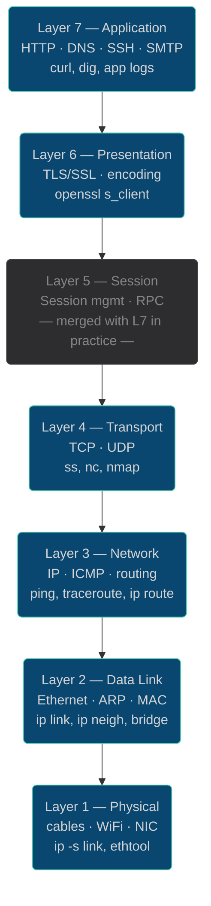
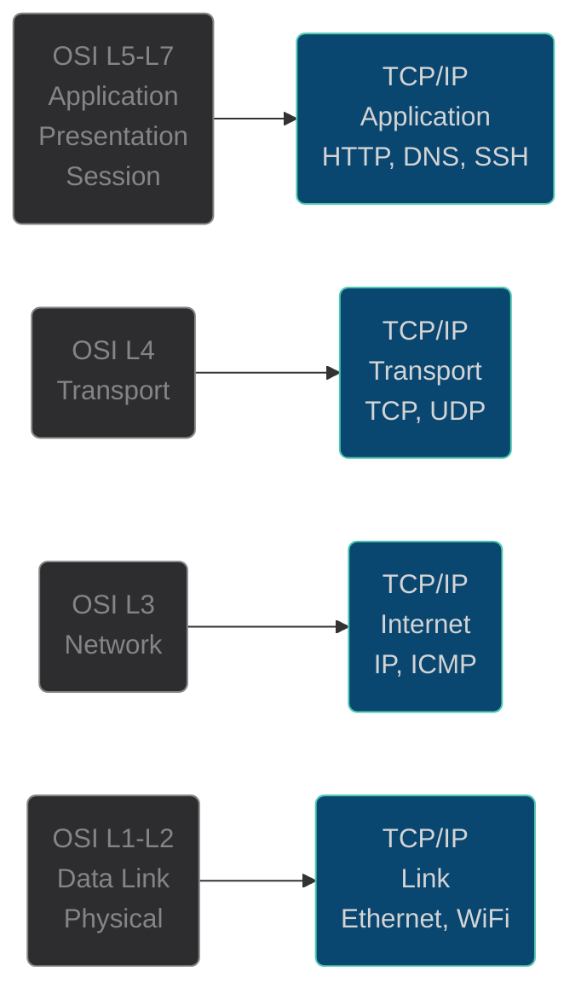

# Network Troubleshooting

## The OSI Model — A Mental Framework

The **OSI (Open Systems Interconnection)** model divides network communication into 7 layers. Each layer depends only on the layer below it and provides services only to the layer above it. This hierarchy is the reason systematic troubleshooting works: a problem at layer 3 cannot be caused by layer 5.



### The TCP/IP Model (What Linux Actually Implements)

In practice, Linux implements the **TCP/IP (Internet) model**, which collapses the 7 OSI layers into 4:



The OSI model is still the universal troubleshooting vocabulary — when someone says "L3 problem" or "this is a L7 issue", they mean OSI layers.

### Layer-to-Tool Mapping

| OSI Layer | Protocol/Concern | Linux Diagnostic Tools |
|-----------|-----------------|----------------------|
| 7 — Application | HTTP, DNS, app errors | `curl`, `dig`, `ss`, app logs |
| 6 — Presentation | TLS, encoding | `openssl s_client`, `curl -v` |
| 4 — Transport | TCP/UDP ports, handshake | `ss`, `nc`, `telnet`, `nmap` |
| 3 — Network | IP routing, reachability | `ping`, `traceroute`, `ip route`, `ip rule` |
| 2 — Data Link | ARP, MAC, interface | `ip link`, `ip neigh`, `arping`, `bridge fdb` |
| 1 — Physical | Link state, errors | `ip -s link`, `ethtool` |

### Encapsulation

When you send an HTTP request, each layer adds its own header as the data passes downward:

```
[HTTP request]
→ TCP wraps it:    [TCP header | HTTP request]
→ IP wraps it:     [IP header | TCP header | HTTP request]
→ Ethernet wraps:  [Eth header | IP header | TCP header | HTTP request | FCS]
→ sent as bits on the wire
```

At the receiving end, each layer strips its own header. This is why a firewall can block at L3 (drop IP packets) without knowing anything about HTTP.

## The Layered Approach

Effective network troubleshooting follows the OSI model from bottom to top. Start at the lowest layer and work up — there's no point debugging DNS if the network cable is unplugged.

```
Layer 7: Application  → Is the service running? Can it accept connections?
Layer 4: Transport    → TCP/UDP reachable? Port open? Firewall blocking?
Layer 3: Network      → IP routing correct? Can we ping? Routing table right?
Layer 2: Link         → Interface up? Link detected? MAC/ARP working?
Layer 1: Physical     → Cable plugged in? (LOWER_UP flag in ip link)
```

## Layer 1-2: Interface and Link State

```bash
# Is the interface up and has physical link?
ip link show
# Look for: UP, LOWER_UP (carrier)
# Bad: NO-CARRIER (cable unplugged or port down)

# Check for errors/drops on the interface
ip -s link show eth0
# RX/TX errors or drops indicate hardware or driver problems
```

## Layer 3: IP and Routing

```bash
# Do we have an IP address?
ip addr show

# Is there a default route?
ip route show default

# Can we reach the default gateway?
GW=$(ip route show default | awk '/default/ {print $3}')
ping -c 3 $GW

# Which route would a packet take?
ip route get 8.8.8.8
```

## ping: Basic Connectivity Test

```bash
# Basic ping
ping -c 4 8.8.8.8

# Ping with interval and flood (requires root for flood)
ping -i 0.2 -c 20 8.8.8.8

# Ping with timeout
ping -c 4 -W 2 8.8.8.8   # -W 2 = 2 second deadline per reply

# Ping with verbose output
ping -v -c 4 192.168.1.1
```

Ping return codes:
- Exit 0: all packets received
- Exit 1: some packets lost
- Exit 2: host unreachable or error

## traceroute / tracepath: Path Discovery

```bash
# Trace the route to a destination
traceroute 8.8.8.8
traceroute -n 8.8.8.8    # no DNS resolution

# tracepath: no root required, shows MTU
tracepath 8.8.8.8
tracepath -n 8.8.8.8
```

`***` in output means a router didn't respond to the probe. This doesn't mean the path is broken — many routers don't respond to traceroute probes.

## mtr: Continuous traceroute

`mtr` combines ping and traceroute — it continuously measures latency and packet loss to each hop:

```bash
# Interactive mtr (Ctrl-C to exit)
mtr 8.8.8.8

# Non-interactive, report mode
mtr -n -r -c 10 8.8.8.8

# With report output
mtr --report 8.8.8.8
```

Use mtr to:
- Identify which hop has packet loss
- Distinguish network congestion (high latency at one hop) from packet loss (low % at one hop vs 100% at the destination)

## Layer 4: Testing Port Reachability

```bash
# Test if a TCP port is open (nc = netcat)
nc -zv 127.0.0.1 22         # -z = scan only, -v = verbose
nc -zv -w 3 10.0.0.1 80     # -w 3 = 3 second timeout

# Test multiple ports
nc -zv 10.0.0.1 80 443 8080

# Test UDP
nc -zuv 10.0.0.1 53

# Use curl for HTTP port testing
curl --connect-timeout 3 -sf http://10.0.0.1:80/ > /dev/null && echo "HTTP OK" || echo "HTTP unreachable"
```

## Checking DNS

```bash
# Is DNS resolving?
dig +short google.com
nslookup google.com

# What DNS server is being used?
cat /etc/resolv.conf | grep nameserver

# Is the DNS server reachable?
NS=$(grep '^nameserver' /etc/resolv.conf | head -1 | awk '{print $2}')
ping -c 2 $NS

# Test DNS with a specific server
dig @8.8.8.8 google.com +short
```

## Checking Routing

```bash
# Can we reach the default gateway?
ip route get 0.0.0.0

# Simulate where a packet to a destination would go
ip route get 10.0.0.5

# Is IP forwarding enabled (needed for routing)?
sysctl net.ipv4.ip_forward
```

## Common Problems and Their Symptoms

| Symptom | Likely Cause | Tools |
|---------|-------------|-------|
| Can't ping anything | No IP, no default route, or interface down | `ip addr`, `ip route`, `ip link` |
| Can ping IP but not hostname | DNS failure | `dig`, `/etc/resolv.conf` |
| Can ping gateway, not internet | Routing issue upstream | `traceroute`, `mtr` |
| Port unreachable | Service down or firewall blocking | `ss -tlnp`, `nc -zv`, `iptables -L` |
| High latency to a hop | Network congestion | `mtr`, `ping` |
| Intermittent packet loss | Flaky cable, overloaded link | `mtr -r -c 100` |
| "Connection refused" | Service not running or wrong port | `ss -tlnp` on target |
| "Connection timed out" | Firewall silently dropping | `nc -zv`, `telnet` |

## Writing a Connectivity Check Script

```bash
#!/bin/bash
# connectivity_check.sh

TARGET=${1:-"8.8.8.8"}
TARGET_HOST=${2:-"google.com"}
PORT=${3:-"443"}

echo "=== Network Connectivity Check ==="
echo "Target IP: $TARGET"
echo "Target Host: $TARGET_HOST"
echo "Port: $PORT"
echo ""

# Layer 3: ping
echo -n "Ping $TARGET: "
if ping -c 2 -W 2 $TARGET > /dev/null 2>&1; then
    echo "OK"
else
    echo "FAIL"
fi

# Layer 4: TCP port
echo -n "TCP port $PORT on $TARGET: "
if nc -z -w 3 $TARGET $PORT > /dev/null 2>&1; then
    echo "OPEN"
else
    echo "CLOSED/FILTERED"
fi

# DNS
echo -n "DNS resolution of $TARGET_HOST: "
if RESOLVED=$(dig +short $TARGET_HOST A | head -1) && [ -n "$RESOLVED" ]; then
    echo "OK ($RESOLVED)"
else
    echo "FAIL"
fi
```

## Further Reading

- [RFC 791 — Internet Protocol](https://datatracker.ietf.org/doc/html/rfc791) — The original IP specification; understanding the IP header (TTL, flags, fragmentation) is essential for reading packet captures.
- [RFC 793 — Transmission Control Protocol](https://datatracker.ietf.org/doc/html/rfc793) — The TCP state machine (SYN, SYN-ACK, ACK, FIN, RST) that underlies every `ss` output and `tcpdump` trace you'll ever read.
- [RFC 792 — ICMP](https://datatracker.ietf.org/doc/html/rfc792) — Defines the ping and traceroute message types; understanding ICMP unreachable codes explains why `ping` can succeed but TCP can't connect.
- [Julia Evans — Networking Zine](https://jvns.ca/networking-zine.pdf) — Free visual reference covering TCP, DNS, TLS, and packet routing in an accessible format; excellent alongside this lesson.
- [Brendan Gregg — Linux Networking Performance](https://www.brendangregg.com/blog/2022-11-17/linux-performance-observability-tools.html) — Maps Linux performance tools to the TCP/IP layer where each one operates.
- [Cloudflare Learning — OSI Model](https://www.cloudflare.com/learning/ddos/glossary/open-systems-interconnection-model-osi/) — Clear explanation of each OSI layer with real-world protocol examples.
- [nicolaka/netshoot](https://github.com/nicolaka/netshoot) — Container image with every network debugging tool pre-installed; useful reference for what tool to reach for at each layer.
- [iproute2-cheatsheet](https://github.com/dmbaturin/iproute2-cheatsheet) — Quick reference for `ip` subcommands used at each layer during systematic troubleshooting.
